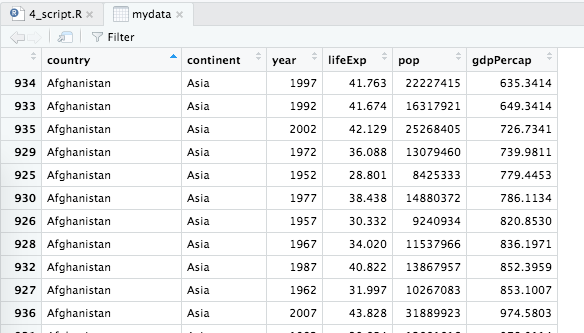

```{r setup, include=FALSE}
knitr::opts_chunk$set(echo=TRUE, warning=FALSE,
                      message=FALSE,
                      fig.width=4.5, fig.height=4.5,
                      fig.align = "center",
                      fig.retina = 2)
library(magrittr)
library(knitr)

```


## We will be using the gapminder dataset (https://www.gapminder.org/):

```{r, message=F, echo = FALSE}
library(tidyverse)
library(gapminder)

gapdata <- gapminder
```




```{r}
gapdata$year %>%   unique()
```

---
## `ggplot()` initialises a canvas

Important: Before `ggplot()` use the pipe (`%>%`); after `ggplot()` use plus (`+`):


.pull-left[
```{r p1, fig.show="hide"}

gapdata %>% 
  filter(year == 2007) %>% 
  ggplot(aes(x = gdpPercap, y=lifeExp))

```

&nbsp;

&nbsp;

&nbsp;

&nbsp;

`filter()` is often useful before `ggplot()`


]

.pull-right[
```{r echo = FALSE}
include_graphics(fig_chunk("p1", "png"))
```

]

---
## ...a canvas to which we can add geoms

geom stands for geometrical. Here we've added `geom_point()`

.pull-left[
```{r p2, fig.show="hide"}

gapdata %>% 
  filter(year == 2007) %>% 
  ggplot(aes(x = gdpPercap, y = lifeExp)) +
  geom_point()

```
]

.pull-right[
```{r echo = FALSE}
include_graphics(fig_chunk("p2", "png"))
```
]
---
## specifying visual properties outside `aes()`

Let's change the colour of the points: `colour = "orange"`

.pull-left[
```{r p3, fig.show="hide"}

gapdata %>% 
  filter(year == 2007) %>% 
  ggplot(aes(x = gdpPercap, y = lifeExp)) +
  geom_point(colour = "orange")

```
]

.pull-right[
```{r echo = FALSE}
include_graphics(fig_chunk("p3", "png"))
```
]

---
## specifying visual properties inside `aes()`

Let's use the variable `continent` to colour the points by (`colour = continent` inside `aes()`):

.pull-left[
```{r p4, fig.show="hide", fig.width=6}
gapdata %>% 
  filter(year == 2007) %>% 
  ggplot(aes(x = gdpPercap, y = lifeExp,
             colour = continent)) +
  geom_point()

```
]

.pull-right[
```{r echo = FALSE}
include_graphics(fig_chunk("p4", "png"))
```
]


---
## There is no limit\* to the `aes()` you can include

In addition to colouring the points by continent, we can size them by population:

.pull-left[
```{r p5, fig.show="hide", fig.width=5}
gapdata %>% 
  filter(year == 2007) %>% 
  ggplot(aes(x = gdpPercap, y = lifeExp,
             colour = continent)) +
  geom_point(shape = 1)

```

&nbsp;

&nbsp;

&nbsp;

\* there is a limit. Press F1 on `geom_point()` to see the list of aesthetics


]

.pull-right[
```{r echo = FALSE}
include_graphics(fig_chunk("p5", "png"))
```
]


---
## From 1 plot to 5 with `facet_wrap(~continent)`

.pull-left[
```{r p6, fig.show="hide", fig.width=6}

gapdata %>% 
  filter(year == 2007) %>% 
  ggplot(aes(x = gdpPercap, y = lifeExp,
             colour = continent)) +
  geom_point() +
  facet_wrap(~continent)

```
]

.pull-right[
```{r echo = FALSE}
include_graphics(fig_chunk("p6", "png"))
```
]

---
## White background - `theme_bw()`

We can also include calculations inside `aes()`: e.g., `x = gdpPercap/1000`

.pull-left[
```{r p7, fig.show="hide", fig.width=6}

gapdata %>% 
  filter(year == 2007) %>% 
  ggplot(aes(x = gdpPercap/1000, y = lifeExp,
             colour = continent)) +
  geom_point() +
  facet_wrap(~continent) +
  theme_bw()
```
]

.pull-right[
```{r echo = FALSE}
include_graphics(fig_chunk("p7", "png"))
```
]


---
## This is how `ggplot()` works - by adding or modifying things one at a time

```{r echo = FALSE}
include_graphics(fig_chunk("p7", "png"))
```


---
## Main geoms:

`geom_point()` or `geom_jitter()`

`geom_line()`

`geom_bar()` and `geom_col()`

`geom_histogram()`

`geom_boxplot()`

`geom_label()` or `geom_text()`

These are just the main ones, Google "ggplot gallery" for many more options.

And the `ggplot()` documentation: http://docs.ggplot2.org/

---
## Exercises

https://argoshare.is.ed.ac.uk/ggplot_intro/


